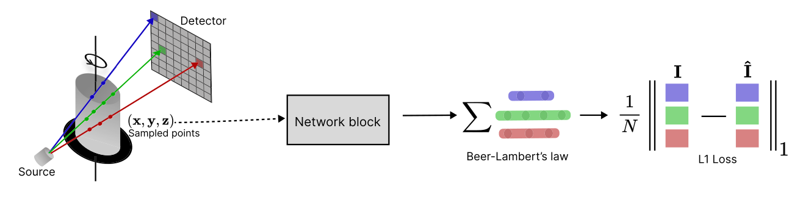

# NeCTv2: Neural Computed Tomography v2

NeCTv2 extends the original [NeCT](https://github.com/haakonnese/nect) with new encoder architectures that substantially reduce GPU memory requirements and improve reconstruction quality, along with a dedicated forward model for continuous-rotation (fly-scan) acquisition. It uses implicit neural representations powered by [`tiny-cuda-nn`](https://github.com/NVlabs/tiny-cuda-nn/) to reconstruct CT volumes directly from raw projection data, supporting both static 3D CT and dynamic 4D CT.

Developed as a master's thesis at NTNU in collaboration with the CT lab at Equinor.

---

## Results at a glance

The original NeCT baseline requires approximately 45 GB of GPU memory and over 40 hours of training per dataset, restricting use to high-end server hardware. NeCTv2 changes that.

| Architecture | PSNR at 24 h | VRAM | vs. baseline |
|---|---|---|---|
| QuadCubes (NeCT baseline) | 35.89 dB | 44.8 GB | — |
| CombinedCubes `18_4_24_4_128` | 37.28 dB | 18.3 GB | +1.39 dB, −59% VRAM |
| **MixedCubes `24_4_24_4_128`** | **37.73 dB** | **22.1 GB** | **+1.84 dB, −51% VRAM** |
| MixedCubes `18_4_22_4_64` (lightweight) | 35.97 dB | 5.1 GB | ≈baseline, −89% VRAM |

The lightweight MixedCubes variant runs on any CUDA-capable GPU with 6 GB of VRAM, making NeCT-class 4D-CT reconstruction accessible on consumer hardware for the first time. Full benchmark results are available in the [thesis](#licensing-and-citation).

<table>
  <tr>
    <td>
      
      <p>Spontaneous imbibition in a Bentheimer sandstone reconstructed using NeCT. Brine (light blue) fills the pore network while salt grains (red) dissolve.</p>
    </td>
    <td>
      
      <p>Dissolution of a salt grain shown across three orthogonal slices. The xz slice shows brine coming into contact with the grain before dissolution begins.</p>
    </td>
  </tr>
</table>



---

## What's new in v2

- **MixedCubes and CombinedCubes** — two new dynamic encoder architectures that outperform the QuadCubes baseline on reconstruction quality, memory, and training speed simultaneously. See [Models](#models) for details.
- **Spatial-heavy QuadCubes** — non-uniform capacity allocation within the QuadCubes architecture that demonstrates the spatial-temporal asymmetry and already outperforms the uniform baseline at lower VRAM.
- **Continuous scanning support** (`reconstruct_continious_scan`) — dedicated trainer for fly-scan geometries where the sample rotates continuously during each exposure, with a K-step midpoint approximation of the resulting angular averaging integral.
- **Static-to-dynamic initialisation** (`IniTrainer`) — pre-train a fast static `hash_grid` model and transfer its weights into a dynamic model, giving the reconstruction a warm start and faster early convergence.
- **Zarr export** (`export_volume_zarr`) — compressed chunked volume export alongside TIFF.
- **Richer configuration** — fine-grained control over warm-up, gradient accumulation (`accumulation_steps`), dampening factors (`damp_multi`), and adaptive detector downsampling during training.

---

## Hardware requirements

| Configuration | Minimum VRAM | Example GPU |
|---|---|---|
| Lightweight MixedCubes `18_4_22_4_64` | 6 GB | GTX 1060, RTX 4060 |
| Best MixedCubes `24_4_24_4_128` | 24 GB | RTX 3090, RTX 4090 |
| Best CombinedCubes `24_4_24_6_128` | 26 GB | RTX 3090, RTX 4090 |
| NeCT baseline QuadCubes | 45 GB | A100 80 GB, H100 |

All configurations require CUDA 12.x.

---

## Installation

Tested on **Windows** and **Linux** with the following dependencies:

| Package | Version | Notes |
|---|---|---|
| Python | 3.11 or 3.12 | |
| PyTorch | 2.4 – 2.7 | |
| CUDA | 12.x | |
| CMake (Linux) | 3.24+ | Required for tiny-cuda-nn |
| C++17 (Windows) | | Required for tiny-cuda-nn |

> Use [conda](https://docs.anaconda.com/free/anaconda/install/) or [uv](https://docs.astral.sh/uv/getting-started/installation/) to manage your environment. For video export with the `avc1` codec, use conda. With uv, export falls back to `mp4v`.

Ensure `PATH` and `LD_LIBRARY_PATH` include the CUDA binaries as described in the [tiny-cuda-nn documentation](https://github.com/NVlabs/tiny-cuda-nn/). Building `tiny-cuda-nn` may take several minutes.

### uv

```bash
uv venv --python=3.12
source venv/bin/activate          # Windows: venv\Scripts\activate
uv pip install -e .[torch]
uv pip install git+https://github.com/NVlabs/tiny-cuda-nn/#subdirectory=bindings/torch --no-build-isolation
```

### conda

```bash
conda create -n nectv2 python=3.12 -y
conda activate nectv2
conda install pytorch==2.5.1 torchvision==0.20.1 pytorch-cuda=12.4 lightning==2.1 conda-forge::opencv -c pytorch -c nvidia -c conda-forge -y
pip install -e .
pip install git+https://github.com/NVlabs/tiny-cuda-nn/#subdirectory=bindings/torch
```

### Multiple CUDA compute capabilities

Set these before installing to build for multiple GPU generations:

```bash
export CUDA_ARCHITECTURES="60;70;80;90"   # P100, V100, A100, H100
export CMAKE_CUDA_ARCHITECTURES=${CUDA_ARCHITECTURES}
export TCNN_CUDA_ARCHITECTURES=${CUDA_ARCHITECTURES}
export TORCH_CUDA_ARCH_LIST="6.0 7.0 8.0 9.0"
export FORCE_CUDA="1"
```

---

## Quick start

### Static CT

```python
import numpy as np
import nect

geometry = nect.Geometry(
    DSD=1500.0,
    DSO=1000.0,
    nDetector=[256, 512],
    dDetector=[1.75, 1.75],
    nVoxel=[256, 512, 256],
    dVoxel=[1.0, 1.0, 1.0],
    angles=np.linspace(0, 360, 49, endpoint=False),
    mode="cone",
    radians=False,
)

volume = nect.reconstruct(
    geometry=geometry,
    projections="path/to/projections.npy",
    quality="medium",
)
np.save("volume.npy", volume)
```

### Dynamic (4D) CT with MixedCubes

```python
import nect

geometry = nect.Geometry.from_yaml("path/to/geometry.yaml")

reconstruction_path = nect.reconstruct(
    geometry=geometry,
    projections="path/to/projections.npy",
    quality="high",
    mode="dynamic",
    model="mixedcubes",
    exp_name="my_experiment",
)
nect.export_video(reconstruction_path, add_scale_bar=True, acquisition_time_minutes=60)
```

### Static-to-dynamic initialisation

Pre-train a static model, then warm-start a dynamic reconstruction from it for faster early convergence:

```python
import nect

geometry = nect.Geometry.from_yaml("path/to/geometry.yaml")

# Step 1 — fast static reconstruction
static_path, _ = nect.reconstruct(
    geometry=geometry,
    projections="path/to/projections.npy",
    quality="high",
    mode="static",
    exp_name="static_init",
)

# Step 2 — dynamic reconstruction initialised from the static model
nect.reconstruct(
    geometry=geometry,
    projections="path/to/projections.npy",
    quality="high",
    mode="dynamic",
    model="mixedcubes",
    exp_name="dynamic_from_static",
    static_init=static_path,
)
```

---

## Models

### Static

| Model | Description |
|---|---|
| `hash_grid` | Multiresolution hash grid — fast, memory-efficient, recommended default |

### Dynamic (4D CT)

| Model | Description |
|---|---|
| `quadcubes` | Four 3D hash encoders covering all triplets of the space-time coordinates — the original NeCT architecture and the baseline for all comparisons |
| `splitcubes` | QuadCubes with a larger spatial encoder and smaller temporal encoders, exploiting the spatial-temporal asymmetry within the original architecture. Outperforms the uniform baseline at lower VRAM with no structural changes |
| `combinedcubes` | One large 3D spatial hash encoder plus three collision-free 2D temporal hash encoders. Reduces VRAM by roughly 60% relative to QuadCubes while improving reconstruction quality |
| `mixedcubes` | One 3D spatial hash encoder plus three fully dense 2D temporal grids. Best reconstruction quality of any architecture at the 24-hour wall-clock mark, fits within 24 GB VRAM, and scales down to 5 GB for lightweight use — **recommended for most workflows** |

---

## Demo

Demo scripts are in the [`demo/`](./demo/) folder. Projection data is downloaded automatically from [Zenodo](https://zenodo.org/records/16448474) on first run.

| Script | Dataset | Description |
|---|---|---|
| `00_static_reconstruct_from_file.py` | Carp-cone | Static reconstruction from a `.npy` file |
| `01_static_reconstruct_from_array.py` | Carp-cone | Static reconstruction from a NumPy array |
| `02_geometry_load.py` | Carp-cone | Load geometry from YAML |
| `03_dynamic_reconstruction_video.py` | SimulatedFluidInvasion | Dynamic reconstruction with video export |
| `04_dynamic_reconstruction_export_volume.py` | SimulatedFluidInvasion | Dynamic reconstruction with volume export |
| `05_parallel_beam.py` | Carp-parallel | Parallel beam geometry |
| `06_export_video_projections.py` | SimulatedFluidInvasion | Export video from projections |
| `07_reconstruct_from_cfg_file.py` | Bentheimer | Reconstruction via config YAML |
| `08_continious_scan.py` | Custom | Continuous-scan reconstruction (requires a continuous-scan dataset) |
| `09_combinedcubes.py` | Bentheimer | Dynamic reconstruction with CombinedCubes |
| `10_mixedcubes.py` | Bentheimer | Dynamic reconstruction with MixedCubes |

---

## Data

All projection data from the dynamic experiments are available on [Zenodo](https://zenodo.org/records/16448474).

---

## Licensing and Citation

This project is licensed under the **MIT License**.

If you use NeCTv2 in your research, please cite:

```bibtex
@mastersthesis{carlenius2025nectv2,
  author  = {Carlenius, Kristian Gautefall},
  title   = {{NeCTv2}: Optimizing Implicit Neural Representations for Discrete
             and Continuous {4D} Computed Tomography of Flow in Porous Media},
  school  = {Norwegian University of Science and Technology ({NTNU})},
  year    = {2025},
  url     = {https://github.com/kristiancarlenius/NeCTv2},
}
```